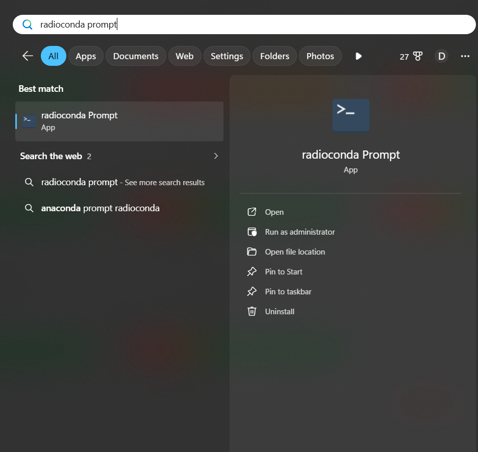
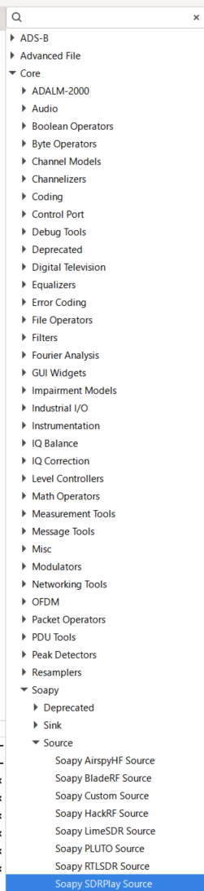
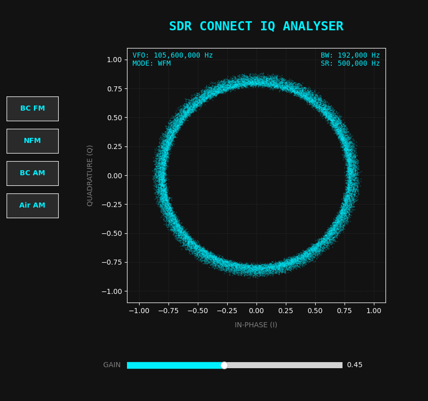
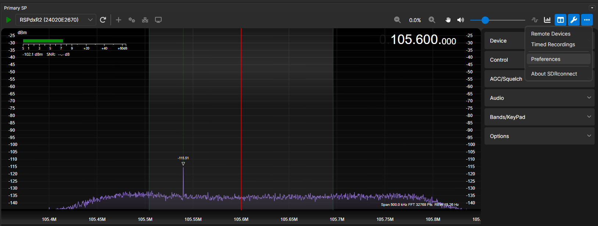
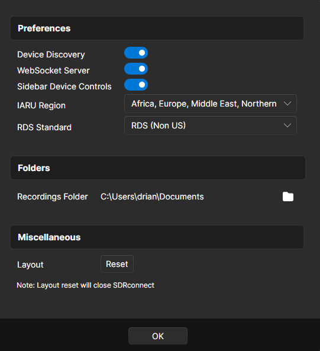
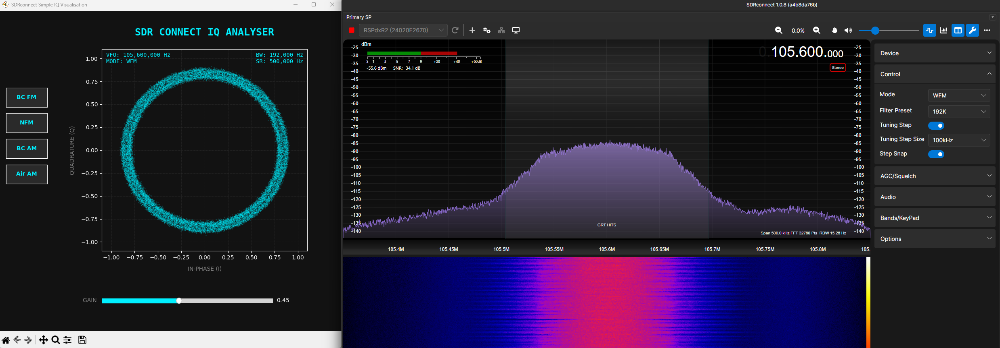

## Introduction

This guide explains how to set up your computer to use an SDRplay device to visualise IQ data. While this ideally requires advanced software like GNU Radio, I have also built a simple plugin for SDRconnect for those wanting a quick feel of what is possible without a steep learning curve.

To use an SDRplay RSP device with GNU Radio, you need both the SDRplay API (the hardware driver) and a bridge for GNU Radio to communicate with it. Using **Radioconda** is the highly recommended "easy path" because it pre-packages GNU Radio with the necessary SoapySDR support.

**Choose your path:**

- **The Full Setup:** Follow the step-by-step guidelines below for GNU Radio.

- **The Quick Start:** If you want a simpler way to view IQ constellation plots, skip straight to the [**Simple IQ Visualisation Plugin for SDRconnect**](#simple-iq-visualisation-plugin-for-sdrconnect) section.

## Step-by-Step Installation Guidelines

The easiest setup process involves installing the hardware driver first, followed by the software environment.

### 1. Install the SDRplay API

Regardless of which software you use, you must install the official hardware driver first so your computer can recognise the device.

- Go to the SDRplay Downloads page.
- Download and [install the API for your platform](https://www.sdrplay.com/api/) (version 3.15 is current).
- **Windows users:** Ensure the installer completes and, if prompted, restart your computer.

### 2. Install Radioconda

Radioconda is a distribution that includes GNU Radio and almost all common SDR drivers pre-configured.

- Download the latest installer from the [Radioconda GitHub](https://github.com/radioconda/radioconda-installer).
- Run the installer according to the ReadMe on the Radioconda GitHub page. This generally involves double-clicking the .exe (Windows) or running the bash shell script (Linux) to set up a complete GNU Radio environment without manual compilation.
- If you are using hardware other than an SDRplay, refer to the [Radioconda ReadMe page](https://github.com/radioconda/radioconda-installer#additional-installation-for-device-support) for further guidelines.

### 3. Connect GNU Radio to your SDRplay

Once both are installed, you can use the device in GNU Radio Companion (GRC):

- Launch Radioconda; Windows users can do this by launching the Radioconda App from the Start Menu.


- Verify the connection using the ```SoapySDRUtil --find``` command. If everything installed correctly and your SDRplay is connected via USB, you should see your device identified:

```text
> SoapySDRUtil --find

######################################################
##     Soapy SDR -- the SDR abstraction library     ##
######################################################

Found device 16
  driver = sdrplay
  label = SDRplay Dev0 UNKNOWN 24020E2670
  serial = 24020E2670
```

> **Tip for Linux Users:** If the command above fails to find your device, use `lsusb` to verify that the OS sees the hardware. If it appears in `lsusb` but not in Soapy, you likely need to manually trigger the SDRplay `udev` rules or restart the API service with `sudo systemctl restart sdrplay`.

- Launch GRC: type ```gnuradio-companion``` in the Radioconda shell to open the GUI.
- Search for a **Soapy Source Block** in the block list on the right-hand side; it should be under `Core -> Soapy -> Source -> SoapySDRPlaySource`.



You are now ready to use GNU Radio to process the IQ output of your SDR receiver. The learning curve can be steep, so I recommend checking out the [GNU Radio wiki](https://wiki.gnuradio.org/). To get you started, I have included several sample flowgraphs in my repository for you to modify and explore. If you have questions, feel free to [email me](mailto:ian@g0lft.org).

## Sample FlowGraphs

These flowgraphs are provided "as-is" in the Git repository: [https://github.com/IanHenry/sdrplay-gnuradio-examples/](https://github.com/IanHenry/sdrplay-gnuradio-examples/).
They allow you to capture raw IQ data from an SDR device and save it to a file. The captured data can then be processed with the included Python script to generate high-quality density plots. 

Instructions for use are in the [README](https://github.com/IanHenry/sdrplay-gnuradio-examples/blob/main/README.md) of the GitHub repository but briefly:

### Repository Structure
- **/flowgraphs**: `.grc` files for capturing and visualising IQ data. 
- **/analysis**: Python scripts for generating IQ density plots from recorded files.
- **/data**: The intended directory for your `.iq` recordings.

### Getting Started
1. **Capture:** Open a flowgraph in GNU Radio Companion. Use the sliders to tune to a signal and record the output. 
2. **Save:** Save your recording (e.g., `capture.iq`) into the **/data** folder.
3. **Plot:** Open a terminal in the **/analysis** folder and run `python iq_density_plotter.py`. 
4. **Customise:** You can edit the `USER SETTINGS` at the top of the script to change the filename or zoom in on specific modulations.

---

## Simple IQ Visualisation Plugin for SDRconnect

If you prefer not to install the dependencies above and just want to view IQ plots using standard SDR software, options are limited. Most standard software does not include constellation plots by default.

To solve this, I wrote a Python app that works with SDRconnect. It uses the WebSocket API (available in version 1.08+) to capture and plot IQ data in real-time.



### Installation instructions for SDRconnect and IQ module

#### 1. Download SDRconnect
- Download [SDRconnect](https://www.sdrplay.com/sdrconnect/) for Windows, MacOS, or Linux. Ensure you are using at least version 1.08.
- Once installed, enable the **WebSocket Server**: click the three dots (top right) -> Preferences -> Enable WebSocket Server.

 

#### 2. Install the Python IQ Module
- Download my script from [https://github.com/IanHenry/sdrconnect-iq-visualiser](https://github.com/IanHenry/sdrconnect-iq-visualiser) and run ```python sdrConnectIQvisualiser.py```. It does not need to be in the SDRconnect directory as it communicates via the network API.
- **Windows users:** A pre-compiled .exe version is also available at [https://github.com/IanHenry/sdrconnect-iq-visualiser/releases/](https://github.com/IanHenry/sdrconnect-iq-visualiser/releases/) for a standalone launch.

### Using the Simple IQ Visualisation Plugin

This tool is designed for visualising strong signals like Broadcast FM/AM, Repeaters, and Airband. It uses an IQ sample window centered on the waterfall. While audio filters are applied in SDRconnect, they do not affect this raw IQ stream. The script automatically periodically re-centers the VFO so the IQ you see matches your tuned frequency.



The visualiser has two main controls:

- **Gain Slider:** This rescales the IQ values on the plot (acting as a "zoom" for the constellation) without affecting the actual receiver gain.

- **Preset Buttons:** Quickly set Mode, audio bandwidth, and sample rate for Broadcast FM, Narrowband FM, Broadcast AM, and Airband.

You can still adjust settings directly in SDRconnect and see the changes reflected in the plot. Note that because the IQ data is centered on the window rather than the VFO line, the script "jumps" the window occasionally to keep your signal centered. This is a workaround for SDRconnect’s current tuning implementation but works well for most use cases.

I built this simple tool to give newcomers an easy starting point—enjoy exploring the signals!
